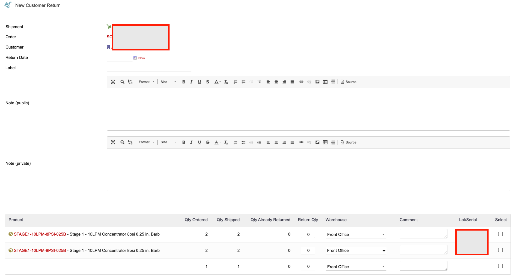
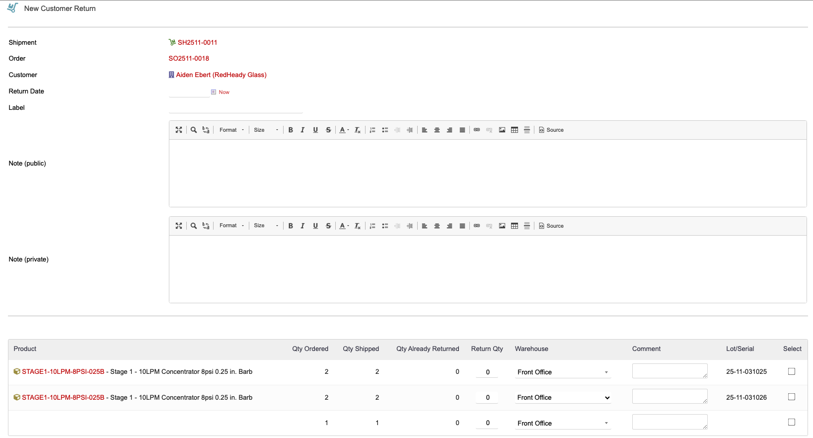

# Customer Returns for Dolibarr

Manage merchandise returns directly inside Dolibarr -- from the original shipment all the way through stock re-entry and credit note generation.

**Version 2.2.1** | [GitHub](https://github.com/zacharymelo/doli-returns) | License: GPL-3.0-or-later

---

## Features

- **Shipment-initiated returns** -- create a return straight from any validated shipment card.
- **Per-line quantity tracking** -- the return form shows qty ordered, qty shipped, qty already returned, and a return qty input so you never exceed what was actually sent.
- **Warehouse and lot/serial selection per line** -- choose which warehouse (and which lot or serial number) each returned item goes back into.
- **Automatic stock re-entry** -- when a return is marked Received, stock movements are created to add the items back into the selected warehouses.
- **Credit note generation** -- one click follows the shipment to its order to its invoice and creates a credit note with the original pricing.
- **Simple 3-status lifecycle** -- Draft, Validated, Received. No unnecessary steps.
- **Public and private notes** on every return record.
- **Debug diagnostic endpoint** for troubleshooting.

## Screenshots

### New return form



### Return form with shipment data



## Requirements

| Requirement | Minimum version |
|-------------|-----------------|
| Dolibarr    | 16.0            |
| PHP         | 7.0             |

The following Dolibarr modules must be enabled before activating Customer Returns:

- **Third Parties**
- **Products**
- **Stock/Warehouses**
- **Shipments**

## Installation

### Option A -- Upload through Dolibarr

1. Download the latest `customerreturn-x.y.z.zip` from [Releases](https://github.com/zacharymelo/doli-returns/releases).
2. In Dolibarr, go to **Home > Setup > Modules/Applications**.
3. Click **Deploy/install an external app/module**.
4. Upload the zip file.
5. Find "Customer Returns" in the module list, enable it, and assign user permissions.

### Option B -- Manual copy

Copy the module files into your Dolibarr custom directory:

```
cp -r module/ /path/to/dolibarr/htdocs/custom/returnmgmt/
```

Then enable and configure the module from the Dolibarr admin panel.

## Configuration

After enabling the module, go to **Home > Setup > Customer Returns Setup** to adjust:

| Setting | Description |
|---------|-------------|
| Return window (days) | How many days after shipment a return is allowed. |
| Auto-approve returns | When enabled, returns skip manual approval and move straight to Validated. |
| Require tracking number | When enabled, a tracking number must be entered before a return can be received. |
| Use Customer Returns for WarrantySvc returns | Links this module with the WarrantySvc RMA module (see Optional Integrations below). |

## Usage Guide

### Where to find Customer Returns

Customer Returns appears in the **Products** sidebar menu. From there you can:

- **Customer Returns > New Return** -- create a return.
- **Customer Returns > List** -- view and filter all existing returns.

### Creating a return

1. Navigate to a validated shipment card and click **Create Return**, or go to **Customer Returns > New Return** and pick a customer and shipment.
2. The form pre-fills the source shipment, linked order, and customer.
3. For each line, you will see the quantity ordered, quantity shipped, and quantity already returned. Enter the quantity being returned.
4. Select the receiving warehouse (and lot/serial number if applicable) for each line.
5. Save. The return is created in **Draft** status.
6. When ready, validate the return to move it to **Validated**.

### Receiving items

1. Open a Validated return.
2. Confirm receipt. The return moves to **Received**.
3. Stock movements are created automatically -- each returned line is added back into the warehouse you selected during creation.

### Generating a credit note

After a return is Received, a **Create Credit Note** button appears on the return card. Clicking it:

1. Follows the link chain from shipment to order to invoice.
2. Creates a credit note containing the returned line items at their original invoice prices.

No manual data entry required.

## Optional Integrations

### WarrantySvc (RMA module)

If the [WarrantySvc module](https://github.com/zacharymelo/RMA-Module) is installed and the integration toggle is enabled in setup, returns can be initiated directly from a service request. The two records are linked automatically so you can trace the full path: **Service Request > Return > Stock Movement / Credit Note**.

## License

This module is licensed under the [GNU General Public License v3.0](https://www.gnu.org/licenses/gpl-3.0.html).
